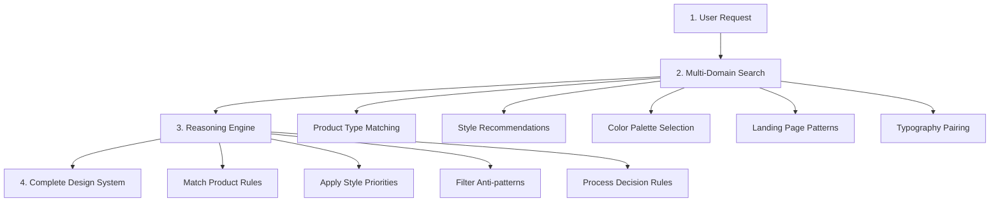

## Overview

The Design System Generator is the flagship feature of UI/UX Pro Max v2.0. It's an AI-powered reasoning engine that analyzes your project requirements and generates a complete, tailored design system in seconds.

Instead of manually searching for styles, colors, and typography, the generator performs **5 parallel searches** across multiple domains and applies **industry-specific reasoning rules** to recommend the best matching design system.

## How It Works

The design system generation follows a 4-step pipeline:



### Step 1: User Request

You provide a natural language request describing your project:

```bash
python3 .claude/skills/ui-ux-pro-max/scripts/search.py "beauty spa wellness" --design-system -p "Serenity Spa"
```

The query can include:
- **Product type**: SaaS, e-commerce, beauty, healthcare, fintech
- **Industry keywords**: wellness, luxury, professional, modern
- **Style hints**: minimal, elegant, playful

### Step 2: Multi-Domain Search (5 Parallel Searches)

The generator executes 5 searches simultaneously using the BM25 search engine:

| Domain | Purpose | Data Source |
|--------|---------|-------------|
| `product` | Match your project to 100 product categories | `products.csv` |
| `style` | Find best matching UI styles from 67 options | `styles.csv` |
| `color` | Select color palette from 96 industry-specific palettes | `colors.csv` |
| `landing` | Recommend page structure from 24 patterns | `landing.csv` |
| `typography` | Choose font pairing from 57 combinations | `typography.csv` |

From `design_system.py:src/ui-ux-pro-max/scripts/design_system.py:51`:

```python
SEARCH_CONFIG = {
    "product": {"max_results": 1},
    "style": {"max_results": 3},
    "color": {"max_results": 2},
    "landing": {"max_results": 2},
    "typography": {"max_results": 2}
}
```

### Step 3: Reasoning Engine

The reasoning engine applies **100 industry-specific rules** from `ui-reasoning.csv` to intelligently select and combine the search results.

#### Reasoning Rule Structure

Each rule (from `design_system.py:src/ui-ux-pro-max/scripts/design_system.py:88`) includes:

- **Recommended Pattern**: Landing page structure optimized for the industry
- **Style Priority**: Ranked list of best matching UI styles
- **Color Mood**: Industry-appropriate color palette characteristics
- **Typography Mood**: Font personality matching the brand
- **Key Effects**: Animations and interactions that work for the use case
- **Anti-Patterns**: What NOT to do (e.g., "AI purple/pink gradients" for banking)
- **Decision Rules**: JSON conditions for conditional logic

#### Priority-Based Selection

The engine uses BM25 ranking with keyword matching (`design_system.py:src/ui-ux-pro-max/scripts/design_system.py:122`):

1. **Exact style name match** (highest priority)
2. **Keyword field match** (medium priority)
3. **General field match** (lowest priority)

This ensures the most relevant styles rise to the top based on the reasoning rules.

### Step 4: Complete Design System Output

The final output includes everything you need to start building:

```
+----------------------------------------------------------------------------------------+
|  TARGET: Serenity Spa - RECOMMENDED DESIGN SYSTEM                                      |
+----------------------------------------------------------------------------------------+
|  PATTERN: Hero-Centric + Social Proof                                                  |
|     Conversion: Emotion-driven with trust elements                                     |
|     CTA: Above fold, repeated after testimonials                                       |
|     Sections: Hero > Services > Testimonials > Booking > Contact                       |
|                                                                                        |
|  STYLE: Soft UI Evolution                                                              |
|     Keywords: Soft shadows, subtle depth, calming, premium feel, organic shapes        |
|                                                                                        |
|  COLORS:                                                                               |
|     Primary:    #E8B4B8 (Soft Pink)                                                    |
|     Secondary:  #A8D5BA (Sage Green)                                                   |
|     CTA:        #D4AF37 (Gold)                                                         |
|                                                                                        |
|  TYPOGRAPHY: Cormorant Garamond / Montserrat                                           |
|     Mood: Elegant, calming, sophisticated                                              |
|                                                                                        |
|  KEY EFFECTS: Soft shadows + Smooth transitions (200-300ms) + Gentle hover states      |
|                                                                                        |
|  AVOID (Anti-patterns): Bright neon colors + Harsh animations + Dark mode              |
+----------------------------------------------------------------------------------------+
```

## Reasoning Rules by Industry

The generator includes 100 specialized rules across these categories:

| Category | Examples |
|----------|----------|
| **Tech & SaaS** | SaaS, Micro SaaS, B2B Enterprise, Developer Tools, AI/Chatbot Platform |
| **Finance** | Fintech, Banking, Crypto, Insurance, Trading Dashboard |
| **Healthcare** | Medical Clinic, Pharmacy, Dental, Veterinary, Mental Health |
| **E-commerce** | General, Luxury, Marketplace, Subscription Box |
| **Services** | Beauty/Spa, Restaurant, Hotel, Legal, Consulting |
| **Creative** | Portfolio, Agency, Photography, Gaming, Music Streaming |
| **Emerging Tech** | Web3/NFT, Spatial Computing, Quantum Computing, Autonomous Systems |

<Tip>
Each rule is carefully crafted to avoid common mistakes. For example, the banking rule explicitly warns against "AI purple/pink gradients" because they reduce trust.
</Tip>

## Output Formats

The generator supports two output formats:

### ASCII Box (Default)

Best for terminal display and MCP tool responses:

```bash
python3 .claude/skills/ui-ux-pro-max/scripts/search.py "fintech" --design-system
```

### Markdown

Best for documentation and sharing:

```bash
python3 .claude/skills/ui-ux-pro-max/scripts/search.py "fintech" --design-system -f markdown
```

## Persistence: Master + Overrides Pattern

You can save the generated design system to files for hierarchical retrieval across sessions:

```bash
# Generate and save to design-system/MASTER.md
python3 .claude/skills/ui-ux-pro-max/scripts/search.py "SaaS dashboard" --design-system --persist -p "MyApp"

# Also create page-specific override
python3 .claude/skills/ui-ux-pro-max/scripts/search.py "SaaS dashboard" --design-system --persist -p "MyApp" --page "dashboard"
```

This creates a folder structure:

```
design-system/
├── MASTER.md           # Global source of truth (colors, typography, spacing, components)
└── pages/
    └── dashboard.md    # Page-specific overrides (only deviations from Master)
```

### Hierarchical Retrieval Logic

From `design_system.py:src/ui-ux-pro-max/scripts/design_system.py:544`:

```markdown
> **LOGIC:** When building a specific page, first check `design-system/pages/[page-name].md`.
> If that file exists, its rules **override** this Master file.
> If not, strictly follow the rules below.
```

This pattern enables:
- **Consistency**: Global design system in one place
- **Flexibility**: Page-specific deviations when needed
- **Context-aware retrieval**: AI knows which file to read based on the current page

<Info>
The Master file includes complete component specs (buttons, cards, inputs, modals), spacing variables, shadow depths, and a pre-delivery checklist.
</Info>

## Example Usage

### Generate for a Beauty Spa

```bash
python3 .claude/skills/ui-ux-pro-max/scripts/search.py "beauty spa wellness service" --design-system -p "Serenity Spa"
```

**Result**: Soft UI Evolution style, calming color palette (soft pink + sage green), elegant typography (Cormorant Garamond), emotion-driven conversion strategy.

### Generate for a Fintech App

```bash
python3 .claude/skills/ui-ux-pro-max/scripts/search.py "fintech banking dashboard" --design-system -p "SecureBank"
```

**Result**: Minimalist style, professional color palette (blue + navy), clean typography (Inter), trust-focused anti-patterns (no AI gradients).

### Generate for a Gaming Platform

```bash
python3 .claude/skills/ui-ux-pro-max/scripts/search.py "gaming esports platform" --design-system -p "GameHub"
```

**Result**: Cyberpunk UI or Vibrant Block-based style, bold colors (neon accents), dynamic typography, motion-driven effects.

## Key Implementation Details

The design system generator is implemented in `design_system.py` with these key components:

- **DesignSystemGenerator class** (`design_system.py:src/ui-ux-pro-max/scripts/design_system.py:37`): Main orchestrator
- **_multi_domain_search()** (`design_system.py:src/ui-ux-pro-max/scripts/design_system.py:51`): Executes parallel searches
- **_apply_reasoning()** (`design_system.py:src/ui-ux-pro-max/scripts/design_system.py:88`): Matches reasoning rules
- **_select_best_match()** (`design_system.py:src/ui-ux-pro-max/scripts/design_system.py:122`): Priority-based selection
- **format_ascii_box()** (`design_system.py:src/ui-ux-pro-max/scripts/design_system.py:242`): ASCII formatting
- **format_markdown()** (`design_system.py:src/ui-ux-pro-max/scripts/design_system.py:367`): Markdown formatting
- **persist_design_system()** (`design_system.py:src/ui-ux-pro-max/scripts/design_system.py:491`): Save to files

## See Also

- [Search Engine](/concepts/search-engine) - Learn about the BM25 search implementation
- [Reasoning Rules](/concepts/reasoning-rules) - Deep dive into the 100 industry-specific rules
- [Skill vs Workflow](/concepts/skill-vs-workflow) - Understand when the design system generator activates
