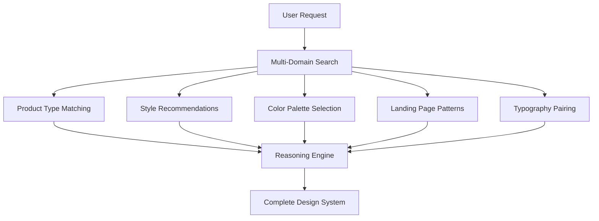

UI/UX Pro Max v2.0 introduces an AI-powered reasoning engine that analyzes your project requirements and generates complete, tailored design systems in seconds.

## How It Works



<Steps>
  <Step title="User provides product description">
    Example: "Build a landing page for my beauty spa"
  </Step>
  
  <Step title="Multi-domain search executes (5 parallel searches)">
    - Product type matching (100 categories)
    - Style recommendations (67 styles)
    - Color palette selection (96 palettes)
    - Landing page patterns (24 patterns)
    - Typography pairing (57 font combinations)
  </Step>
  
  <Step title="Reasoning engine applies industry rules">
    - Match product → UI category rules
    - Apply style priorities (BM25 ranking)
    - Filter anti-patterns for industry
    - Process decision rules (JSON conditions)
  </Step>
  
  <Step title="Output complete design system">
    Pattern + Style + Colors + Typography + Effects + Anti-patterns + Checklist
  </Step>
</Steps>

## Generate Design System

### Basic Command

Generate a design system recommendation:

```bash
python3 .shared/ui-ux-pro-max/scripts/search.py "<product_type> <industry> <keywords>" --design-system
```

### With Project Name

Add a project name for branded output:

```bash
python3 .shared/ui-ux-pro-max/scripts/search.py "beauty spa wellness" --design-system -p "Serenity Spa"
```

**Terminal output:**
```ansi
+----------------------------------------------------------------------------------------+
|  TARGET: Serenity Spa - RECOMMENDED DESIGN SYSTEM                                      |
+----------------------------------------------------------------------------------------+
|                                                                                        |
|  PATTERN: Hero-Centric + Social Proof                                                  |
|     Conversion: Emotion-driven with trust elements                                     |
|     CTA: Above fold, repeated after testimonials                                       |
|     Sections:                                                                          |
|       1. Hero                                                                          |
|       2. Services                                                                      |
|       3. Testimonials                                                                  |
|       4. Booking                                                                       |
|       5. Contact                                                                       |
|                                                                                        |
|  STYLE: Soft UI Evolution                                                              |
|     Keywords: Soft shadows, subtle depth, calming, premium feel, organic shapes        |
|     Best For: Wellness, beauty, lifestyle brands, premium services                     |
|     Performance: Excellent | Accessibility: WCAG AA                                    |
|                                                                                        |
|  COLORS:                                                                               |
|     Primary:    #E8B4B8 (Soft Pink)                                                    |
|     Secondary:  #A8D5BA (Sage Green)                                                   |
|     CTA:        #D4AF37 (Gold)                                                         |
|     Background: #FFF5F5 (Warm White)                                                   |
|     Text:       #2D3436 (Charcoal)                                                     |
|     Notes: Calming palette with gold accents for luxury feel                           |
|                                                                                        |
|  TYPOGRAPHY: Cormorant Garamond / Montserrat                                           |
|     Mood: Elegant, calming, sophisticated                                              |
|     Best For: Luxury brands, wellness, beauty, editorial                               |
|     Google Fonts: https://fonts.google.com/share?selection.family=...                  |
|                                                                                        |
|  KEY EFFECTS:                                                                          |
|     Soft shadows + Smooth transitions (200-300ms) + Gentle hover states                |
|                                                                                        |
|  AVOID (Anti-patterns):                                                                |
|     Bright neon colors + Harsh animations + Dark mode + AI purple/pink gradients       |
|                                                                                        |
|  PRE-DELIVERY CHECKLIST:                                                               |
|     [ ] No emojis as icons (use SVG: Heroicons/Lucide)                                 |
|     [ ] cursor-pointer on all clickable elements                                       |
|     [ ] Hover states with smooth transitions (150-300ms)                               |
|     [ ] Light mode: text contrast 4.5:1 minimum                                        |
|     [ ] Focus states visible for keyboard nav                                          |
|     [ ] prefers-reduced-motion respected                                               |
|     [ ] Responsive: 375px, 768px, 1024px, 1440px                                       |
|                                                                                        |
+----------------------------------------------------------------------------------------+
```

### Output Formats

<CodeGroup>
```bash ASCII Box (Default)
python3 .shared/ui-ux-pro-max/scripts/search.py "fintech crypto" --design-system
```

```bash Markdown Format
python3 .shared/ui-ux-pro-max/scripts/search.py "fintech crypto" --design-system -f markdown
```
</CodeGroup>

## Real-World Examples

### SaaS Dashboard

```bash
python3 .shared/ui-ux-pro-max/scripts/search.py "saas dashboard analytics" --design-system -p "DataFlow"
```

**Output highlights:**
- **Pattern:** Feature-Rich Showcase + Data-Dense Dashboard
- **Style:** Glassmorphism + Data-Dense
- **Colors:** Trust blue (#2563EB), Neutral grey, Accent contrast
- **Typography:** Inter / IBM Plex Sans (Modern, professional)
- **Effects:** Hover tooltips, Chart zoom, Real-time pulse
- **Anti-patterns:** Ornate design, Slow rendering, AI purple/pink gradients

### E-commerce Store

```bash
python3 .shared/ui-ux-pro-max/scripts/search.py "ecommerce fashion luxury" --design-system -p "Luxe Boutique"
```

**Output highlights:**
- **Pattern:** Feature-Rich Showcase + Hero-Centric
- **Style:** Liquid Glass + Glassmorphism
- **Colors:** Premium colors (Black, Gold, White), Minimal accent
- **Typography:** Playfair Display / Montserrat (Elegant, refined)
- **Effects:** Chromatic aberration, Fluid animations (400-600ms)
- **Anti-patterns:** Vibrant & Block-based, Playful colors

### Healthcare App

```bash
python3 .shared/ui-ux-pro-max/scripts/search.py "healthcare medical clinic" --design-system -p "HealthConnect"
```

**Output highlights:**
- **Pattern:** Trust & Authority + Conversion
- **Style:** Accessible & Ethical + Minimalism
- **Colors:** Medical Blue (#0077B6), Trust White, Health Green
- **Typography:** Source Sans Pro / Open Sans (Readable, professional)
- **Effects:** Soft box-shadow, Smooth press (150ms)
- **Anti-patterns:** Bright neon colors, Motion-heavy animations, AI purple/pink gradients
- **Requirements:** WCAG AAA compliance, Emergency contact prominent

### Gaming Platform

```bash
python3 .shared/ui-ux-pro-max/scripts/search.py "gaming esports platform" --design-system -p "GameArena"
```

**Output highlights:**
- **Pattern:** Feature-Rich Showcase + Interactive Demo
- **Style:** 3D & Hyperrealism + Retro-Futurism
- **Colors:** Vibrant, Neon accents, Immersive gradients
- **Typography:** Rajdhani / Roboto (Bold, impactful)
- **Effects:** WebGL 3D rendering, Glitch effects, Real-time stats
- **Anti-patterns:** Minimalist design, Static assets

## Reasoning Engine

The design system generator includes **100 industry-specific reasoning rules**:

### Rule Categories

| Category | Examples |
|----------|----------|
| **Tech & SaaS** | SaaS, Micro SaaS, B2B Enterprise, Developer Tools, AI/Chatbot Platform |
| **Finance** | Fintech, Banking, Crypto, Insurance, Trading Dashboard |
| **Healthcare** | Medical Clinic, Pharmacy, Dental, Veterinary, Mental Health |
| **E-commerce** | General, Luxury, Marketplace, Subscription Box |
| **Services** | Beauty/Spa, Restaurant, Hotel, Legal, Consulting |
| **Creative** | Portfolio, Agency, Photography, Gaming, Music Streaming |
| **Emerging Tech** | Web3/NFT, Spatial Computing, Quantum Computing, Autonomous Systems |

### Rule Structure

Each reasoning rule includes:

<AccordionGroup>
  <Accordion title="Recommended Pattern">
    Landing page structure (Hero-Centric, Feature-Rich, Conversion-Optimized, etc.)
  </Accordion>
  
  <Accordion title="Style Priority">
    Best matching UI styles with performance and accessibility ratings
  </Accordion>
  
  <Accordion title="Color Mood">
    Industry-appropriate color palettes with hex codes
  </Accordion>
  
  <Accordion title="Typography Mood">
    Font personality matching with Google Fonts imports
  </Accordion>
  
  <Accordion title="Key Effects">
    Animations, transitions, and interaction patterns
  </Accordion>
  
  <Accordion title="Decision Rules">
    JSON conditions for dynamic recommendations
  </Accordion>
  
  <Accordion title="Anti-Patterns">
    What NOT to do (e.g., "AI purple/pink gradients" for banking)
  </Accordion>
</AccordionGroup>

### Decision Rules Example

From `ui-reasoning.csv` for **Fintech/Banking**:

```json
{
  "must_have": "security-first",
  "if_dashboard": "use-dark-mode",
  "anti_patterns": ["Playful design", "Unclear fees", "AI purple/pink gradients"]
}
```

## Multi-Domain Search Details

The design system generator performs **5 parallel searches**:

### 1. Product Type Matching

**Database:** `products.csv` (100 categories)

**Query:** Product type keywords extracted from user request

**Returns:**
- Matched product category
- Recommended UI category
- Industry classification

### 2. Style Recommendations

**Database:** `styles.csv` (67 styles)

**Query:** Industry + style keywords

**Returns:**
- Style name (Glassmorphism, Soft UI Evolution, etc.)
- Visual keywords
- Performance rating
- Accessibility level
- Best use cases

### 3. Color Palette Selection

**Database:** `colors.csv` (96 palettes)

**Query:** Product type + mood keywords

**Returns:**
- Primary, secondary, CTA colors (hex codes)
- Background and text colors
- Usage notes
- Industry appropriateness

### 4. Landing Page Patterns

**Database:** `landing.csv` (24 patterns)

**Query:** Conversion goals + product type

**Returns:**
- Pattern name (Hero-Centric, Feature-Rich, etc.)
- Section structure
- CTA strategy
- Conversion tactics

### 5. Typography Pairing

**Database:** `typography.csv` (57 pairings)

**Query:** Brand mood + industry

**Returns:**
- Heading font / Body font
- Font personality (Elegant, Modern, Playful, etc.)
- Google Fonts import URL
- Best use cases

## Integration with AI Assistants

### Auto-Activation

In skill mode (Claude Code, Cursor, Windsurf), the design system generator activates automatically:

```
User: Build a landing page for my beauty spa

Assistant: I'll generate a design system for your beauty spa.
[Runs: python3 .shared/ui-ux-pro-max/scripts/search.py "beauty spa wellness" --design-system -p "Beauty Spa"]
[Implements design with recommended colors, typography, and patterns]
```

### Manual Invocation

For workflow mode (Kiro, GitHub Copilot):

```
/ui-ux-pro-max Build a landing page for my beauty spa
```

## Pre-Delivery Checklist

Every design system includes a **7-point checklist** for quality assurance:

- [ ] **No emojis as icons** - Use SVG icons (Heroicons/Lucide)
- [ ] **cursor-pointer on clickables** - All interactive elements
- [ ] **Smooth transitions** - 150-300ms for hover states
- [ ] **Text contrast** - 4.5:1 minimum in light mode
- [ ] **Focus states visible** - For keyboard navigation
- [ ] **prefers-reduced-motion** - Respect user preferences
- [ ] **Responsive breakpoints** - 375px, 768px, 1024px, 1440px

## Common Anti-Patterns

The reasoning engine actively filters out anti-patterns:

<Warning>
  **For Financial Services:**
  - AI purple/pink gradients
  - Playful design language
  - Hidden security indicators
  - Light backgrounds for dashboards
</Warning>

<Warning>
  **For Healthcare:**
  - Bright neon colors
  - Motion-heavy animations
  - Low contrast text
  - Missing accessibility features
</Warning>

<Warning>
  **For E-commerce:**
  - Flat design without depth
  - Text-heavy product pages
  - Low-quality imagery
  - Slow loading times
</Warning>

## Next Steps

<CardGroup cols={2}>
  <Card title="Persist Design System" icon="floppy-disk" href="/guides/persist-design-system">
    Learn the Master + Overrides pattern for hierarchical retrieval
  </Card>
  <Card title="Stack Guidelines" icon="layer-group" href="/guides/stack-guidelines">
    Get implementation-specific best practices for your tech stack
  </Card>
</CardGroup>